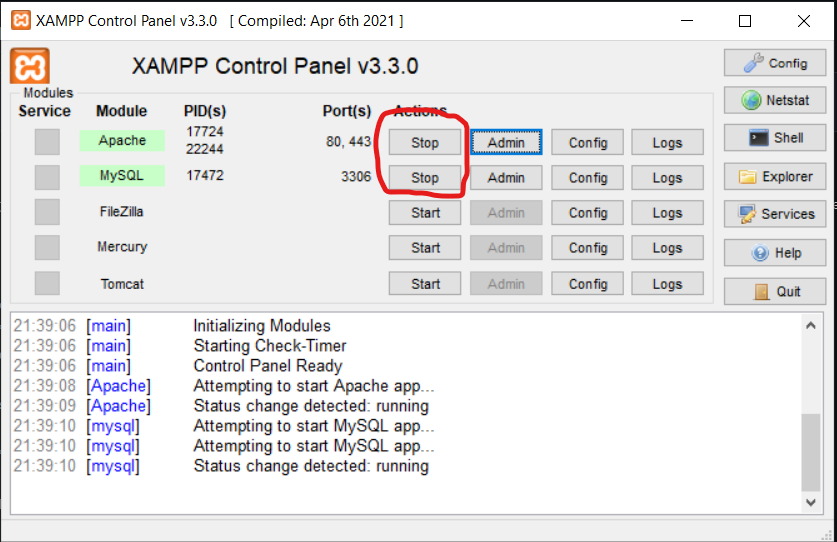
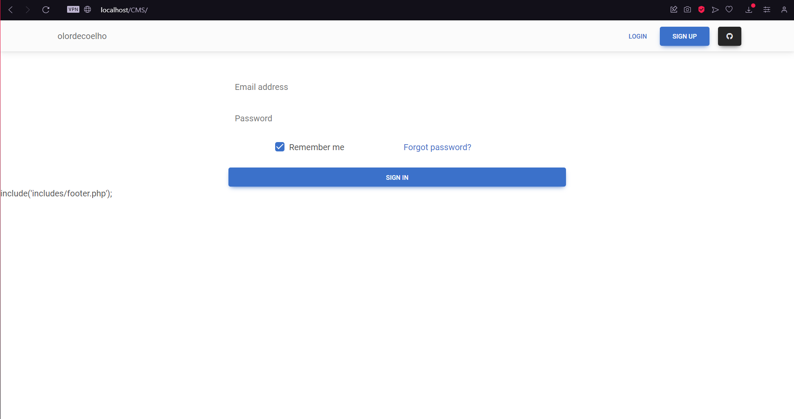

# Meu Blog

Este é um projeto fullstack de um blog desenvolvido com PHP. O projeto consiste em um sistema onde os usuários podem criar, visualizar, editar e excluir postagens, além de interagir por meio de comentários.

## Recursos

- **Autenticação de Usuário**: Os usuários podem se cadastrar e fazer login para acessar o sistema.
- **Postagens**: Os usuários podem criar, visualizar, editar e excluir postagens.
- **Comentários**: Os usuários podem comentar nas postagens.

## Tecnologias Utilizadas

- **Frontend**: HTML, CSS, JavaScript, bootstrap.
- **Backend**: PHP, Javascript.
- **Banco de Dados**: MySQL

## Requisitos

1. Baixe e instale o [XAMPP](https://www.apachefriends.org/pt_br/index.html);
2. Ative o servidor Apache e o MySQL:
   

## Instalação

1. Navegue até a pasta XAMPP/htdocs;
   
2. Clone este repositório:
   ''' git clone https://github.com/seu-usuario/nome-do-repositorio.git '''
   
3. Abra o navegador e cole o caminho:
   ''' http://localhost/CMS/ '''
   
4. Voilà...
   
